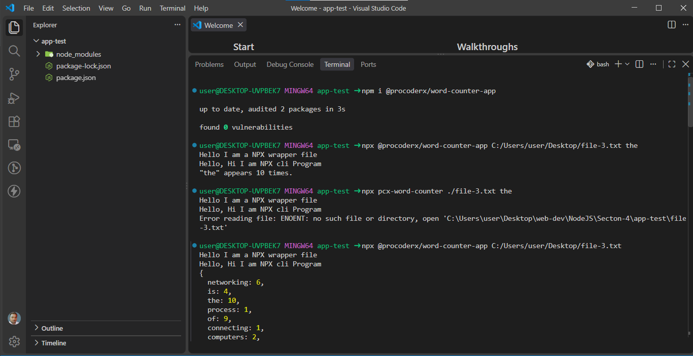
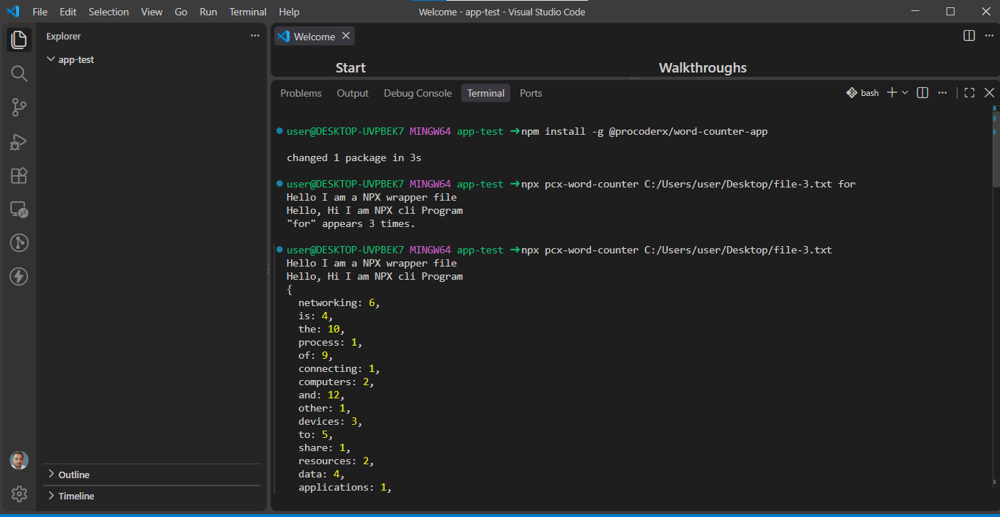

# @procoderx/word-counter-app

> A modular Node.js CLI tool for counting words and generating word-frequency maps directly from the terminal.

[](https://www.npmjs.com/package/@procoderx/word-counter-app)
[](https://www.npmjs.com/package/@procoderx/word-counter-app)
[](https://www.npmjs.com/package/@procoderx/word-counter-app)

---

## Overview

`@procoderx/word-counter-app` is a Node.js command-line utility for analyzing words in a text file.

It supports two analysis modes:

- Generate a complete word-frequency map.
- Count occurrences of a specific target word.

The CLI is available through the `pcx-word-counter` command.

---

## Features

- **Dual-Mode Analysis** — Generate a complete word-frequency map or count a specific target word.
- **Node.js CLI** — Run the tool directly from the terminal.
- **Modern ES Modules** — Uses JavaScript ES Modules with a separation between CLI and core logic.
- **Scoped npm Package** — Published under the `@procoderx` npm scope.
- **npx Support** — Run the package without a global installation.
- **Global CLI Support** — Install the package globally and use `pcx-word-counter` from anywhere.

---

## Quick Start

Run the package directly with `npx`:

```bash
npx @procoderx/word-counter-app ./file-3.txt
```

To count a specific word:

```bash
npx @procoderx/word-counter-app ./file-3.txt the
```

---

## Installation

### Global Installation

Install the package globally:

```bash
npm install -g @procoderx/word-counter-app
```

Then use the CLI:

```bash
pcx-word-counter ./file-3.txt
```

### Local Installation

Install the package in an existing Node.js project:

```bash
npm install @procoderx/word-counter-app
```

Run the CLI locally with:

```bash
npx pcx-word-counter ./file-3.txt
```

Or:

```bash
npm exec pcx-word-counter -- ./file-3.txt
```

### Using npx Without Installation

You can run the published package directly without installing it permanently:

```bash
npx @procoderx/word-counter-app ./file-3.txt
```

---

## Usage

### Syntax

```bash
pcx-word-counter <path-to-file> [target-word]
```

| Argument         | Required | Description                                        |
| ---------------- | -------- | -------------------------------------------------- |
| `<path-to-file>` | Yes      | Path to the text file to analyze.                  |
| `[target-word]`  | No       | Specific word whose occurrences should be counted. |

---

## Examples

### Generate a Complete Word-Frequency Map

Provide only the file path:

```bash
pcx-word-counter ./file-3.txt
```

The CLI generates a frequency map containing the words found in the file and their occurrence counts.

Example:

```json
{
  "the": 12,
  "word": 5,
  "counter": 3,
  "app": 2
}
```

### Count a Specific Word

Provide a second argument containing the target word:

```bash
pcx-word-counter ./file-3.txt the
```

Example output:

```text
"the" occurs 12 times.
```

---

## Screenshots

### npx Usage



### Global Installation



---

## How It Works

The application separates command-line handling from the core text-processing logic.

1. The CLI receives the file path and optional target word.
2. The application reads the specified text file.
3. The text is processed by the word-counting logic.
4. Without a target word, a complete word-frequency map is generated.
5. With a target word, the occurrence count for that word is returned.

---

## Project Architecture

```text
word-counter-app/
├── bin/
│   └── index.js                 # CLI entry point and argument handling
├── lib/
│   └── counter.js               # Core file-reading and word-counting logic
├── screenshots/
│   ├── npx-usage.png            # npx usage screenshot
│   └── global-installation.png  # Global CLI usage screenshot
├── package.json                 # Package metadata and CLI configuration
└── README.md                    # Project documentation
```

### `bin/index.js`

The CLI entry point is responsible for:

- Starting the CLI application
- Reading command-line arguments
- Validating CLI input
- Calling the appropriate counting functionality
- Displaying results in the terminal

### `lib/counter.js`

Contains the core application logic responsible for:

- Reading the input file
- Processing text
- Counting words
- Generating word-frequency data

### `package.json`

Defines:

- Package metadata
- npm package name and version
- ES Module configuration
- CLI binary mapping
- npm package configuration

---

## Requirements

- Node.js
- npm

Check your installed versions:

```bash
node -v
npm -v
```

---

## Repository

Source code and package information:

- **GitHub:** [theprocoderx/pcx-word-counter](https://github.com/theprocoderx/pcx-word-counter)
- **npm:** [@procoderx/word-counter-app](https://www.npmjs.com/package/@procoderx/word-counter-app)

---

## License

This project is licensed under the **ISC License**.

---

## Author

**ProCoderX (Magan Singh)**

Building practical Node.js tools and developer-focused projects.

- **Website:** [procoderx.com](https://procoderx.com)
- **GitHub:** [@TheProCoderX](https://github.com/theprocoderx)
- **LinkedIn:** [ProCoderX](https://www.linkedin.com/in/procoderx)
- **npm:** [@procoderx](https://www.npmjs.com/~procoderx)
- **Email:** [procoderxs@gmail.com](mailto:procoderxs@gmail.com)
